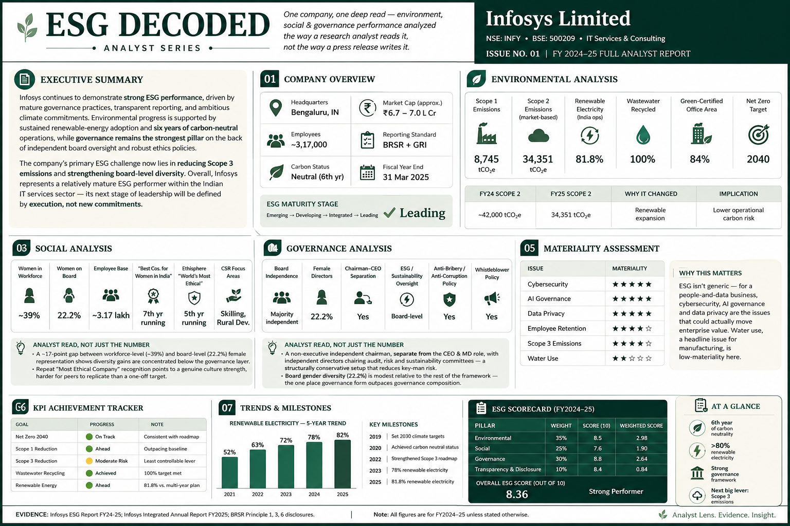

# ESG Decoded

> **Analyst-style ESG research series evaluating listed companies using a structured sustainability assessment framework.**

<p align="center">
  
</p>

<p align="center">


</p>

---

# About the Project

**ESG Decoded** is an analyst-style research initiative designed to transform lengthy corporate sustainability disclosures into concise, structured, and decision-oriented ESG reports.

Unlike conventional ESG summaries, each issue follows a consistent analytical framework that evaluates companies across environmental, social, governance, and disclosure dimensions while incorporating strategic interpretation, risk assessment, industry benchmarking, and forward-looking insights.

The objective is to demonstrate how publicly available sustainability data can be converted into executive-level business intelligence.

---

# Executive Snapshot

| Category | Details |
|-----------|---------|
| Company | Infosys Limited |
| Industry | IT Services & Consulting |
| Fiscal Year | FY2024–25 |
| Overall ESG Score | **8.3 / 10** |
| ESG Maturity | **Leading** |
| Momentum Score | **8.8 / 10** |

---

# Repository Structure

```text
ESG-Decoded/
│
├── README.md
│
├── Issue-01-Infosys/
│
│   ├── Report/
│   │      ESG_Decoded_Infosys_Full_Report.pdf
│   │
│   ├── Presentation/
│   │      ESG_Decoded_Infosys_Analyst_Brief.pptx
│   │
│   ├── Infographic/
│   │      ESG_Decoded_Executive_Dashboard.png
│   │
│   ├── Data/
│   │      ESG_Metrics.xlsx
│   │
│   └── Assets/
│
└── LICENSE
```

---

# Project Deliverables

- Executive ESG Dashboard
- Full Analyst Report (PDF)
- Analyst Brief Presentation (PowerPoint)
- ESG Dataset
- Structured ESG Scoring Framework
- Executive Research Publication

---

# ESG Assessment Framework

The evaluation framework is built around four core pillars.

| Assessment Pillar | Weight |
|-------------------|-------:|
| Environmental | 35% |
| Social | 25% |
| Governance | 30% |
| Transparency & Disclosure | 10% |

Each pillar considers:

- Quantitative ESG Performance
- Strategic Targets
- Year-over-Year Progress
- Disclosure Quality
- Industry Context
- Analyst Assessment

---

# Key Features

- Executive ESG Dashboard
- ESG Maturity Assessment
- KPI Achievement Tracker
- Materiality Assessment
- ESG Momentum Score
- SWOT Analysis
- Stakeholder Impact Assessment
- Industry Benchmarking
- Framework Alignment
- ESG Risk Assessment
- Analyst Commentary
- Strategic Outlook

---

# Research & Analysis Tools

- Microsoft Excel
- Microsoft PowerPoint
- Microsoft Word
- Git
- GitHub

---

# Analytical Framework & Methodologies

- Environmental, Social & Governance (ESG) Analysis
- Sustainability Reporting Analysis (BRSR, GRI & Integrated Reports)
- Corporate Governance Assessment
- Materiality Assessment
- ESG KPI Evaluation & Performance Tracking
- ESG Risk Assessment
- SWOT Analysis
- Comparative Industry Benchmarking
- Trend & Momentum Analysis
- Strategic Business Analysis
- Executive Report Writing
- Data Visualization

---

# Primary Data Sources

This research is based entirely on publicly available corporate disclosures.

Primary references include:

- Infosys ESG Report FY2024–25
- Infosys Integrated Annual Report FY2024–25
- Business Responsibility & Sustainability Report (BRSR)
- Global Reporting Initiative (GRI) Disclosures
- CDP Climate Disclosure
- Infosys Investor Relations

Peer references:

- Wipro Annual Report & Sustainability Disclosures
- Tata Consultancy Services Annual Report & ESG Disclosures

---

# Methodology

The ESG ratings presented in this repository are independently developed using a structured analytical framework.

Each company is evaluated using multiple qualitative and quantitative parameters, including:

- ESG Performance Indicators
- Long-Term Sustainability Commitments
- Year-over-Year Improvement
- Disclosure Quality & Transparency
- Governance Structure
- Material ESG Risks
- Industry-Specific Context
- Comparative Benchmarking

The methodology is designed for educational, analytical, and portfolio purposes and should not be interpreted as an official ESG rating methodology.

---

# Roadmap

| Status | Issue |
|---------|-------|
| ✅ Completed | Issue 01 – Infosys |
| 🔄 Planned | Issue 02 – TCS |
| 🔄 Planned | Issue 03 – Wipro |
| 🔄 Planned | Issue 04 – Tata Steel |
| 🔄 Planned | Issue 05 – ITC |
| 🔄 Planned | Issue 06 – HUL |

---

# Disclaimer

This repository has been developed exclusively for educational, research, and portfolio purposes.

All analysis is based on publicly available corporate disclosures. The ESG scores presented are independently developed analytical assessments and are **not** official ESG ratings or investment recommendations.

---

# Author

## Prachi Singh

**M.Sc. Financial Economics**

Interested in:

- ESG Research
- Sustainability Analytics
- Financial Analysis
- Business Strategy
- Data Analytics

---

## If you found this project interesting, consider giving the repository a ⭐.
